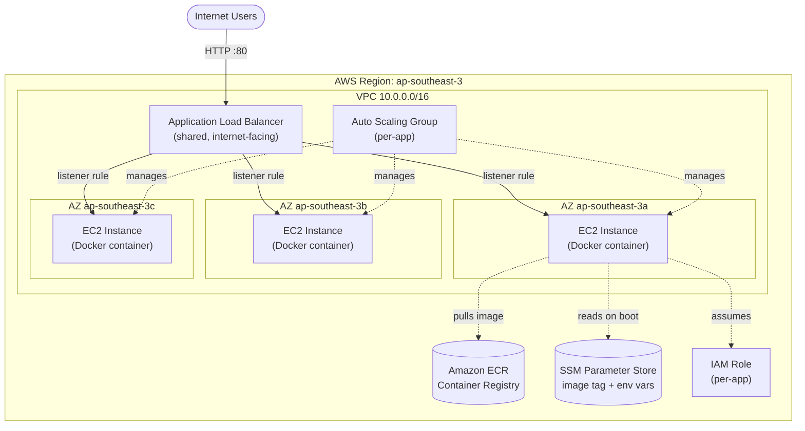
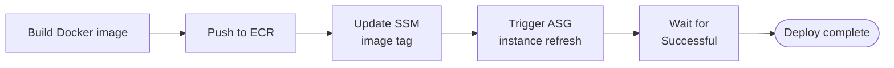

# Architecture Overview

## Executive Summary

We built the AWS infrastructure for running our containerized web app on EC2, with full autoscaling support, while staying inside the operations team's existing skill set (no ECS, no EKS, no Kubernetes).

The result is two things:

1. **A pre-baked Ubuntu AMI** (built by Packer) that boots ready to run Docker, ship metrics, and self-update.
2. **A Terraform stack** that provisions the network, a shared load balancer, and a per-app autoscaling group whose runtime config (image tag + env vars) lives in AWS SSM Parameter Store.

The design lets CI/CD deploy new versions **without ever touching Terraform** -- it just updates an SSM parameter and triggers a rolling instance refresh. It is also explicitly built to host **multiple apps under one ALB** as the team grows.

---

## High-Level Architecture



**Key points to read off the diagram:**

- The ALB sits in the public subnets and is **shared across apps**. Each app registers itself via a listener rule.
- The ASG spans **three Availability Zones** for fault tolerance.
- Every instance reads its config from **SSM at boot** -- there is no "golden config" baked into the AMI.

---

## What We Built, Component by Component

### 1. The AMI (Packer)

Pre-baked image so instance startup time is dominated by `docker pull`, not by `apt install`.

| Component | Why |
|---|---|
| Ubuntu 24.04 LTS x86-64 | LTS, well-supported, team's standard |
| Docker engine + Compose plugin | Container runtime |
| AWS CLI v2 | For SSM reads, ECR login, self-tagging |
| Prometheus `node_exporter` (systemd) | Host metrics on :9100, scrapeable by future Prometheus |
| ZSH + OhMyZSH (history, docker, docker-compose plugins, auto-update) | Friendlier ops shell |
| Unattended-upgrades, scheduled at midnight UTC+7 (17:00 UTC) | Automatic OS patching during off-hours |

Build with `packer build packer/ubuntu-docker.pkr.hcl`. The resulting AMI ID is then fed to Terraform via `var.ami_id`.

### 2. The Terraform Stack

Split into two logical halves:

#### Shared Infrastructure (one per environment)

| File | Purpose |
|---|---|
| [vpc.tf](../terraform/vpc.tf) | VPC, three public subnets across 3 AZs, IGW |
| [security-groups.tf](../terraform/security-groups.tf) (ALB SG) | Shared SG: allows :80/:443 from internet |
| [alb.tf](../terraform/alb.tf) | Internet-facing ALB. Default listener action returns **HTTP 404 fixed response** so unmatched traffic is rejected cleanly |

#### Per-App Resources (one set per app)

These files are prefixed `app-*.tf`. Adding a new app means duplicating them with a different `app_name`.

| File | Purpose |
|---|---|
| [app-target-group.tf](../terraform/app-target-group.tf) | Target group + ALB listener rule (currently catch-all `/*` at priority 100) |
| [app-iam.tf](../terraform/app-iam.tf) | IAM role for EC2: SSM read, EC2 self-tag, ECR pull |
| [app-ssm.tf](../terraform/app-ssm.tf) | SSM parameters under `/<project>/<env>/<app_name>/...` with `lifecycle { ignore_changes = [value] }` |
| [security-groups.tf](../terraform/security-groups.tf) (EC2 SG) | Per-app SG: app port from ALB only, SSH from allowlist, :9100 from VPC |
| [app-asg.tf](../terraform/app-asg.tf) | Launch template + ASG, attached to target group, instance refresh enabled |
| [templates/user-data.sh.tftpl](../terraform/templates/user-data.sh.tftpl) | Boot script (see next section) |

### 3. The Boot Script

This is the glue. Every new instance runs it once, and it is the only thing that connects "instance hardware" to "running app." Concretely it:

1. **Self-tags** the instance as `<asg-name>-<last-4-of-instance-id>` via IMDSv2 + `aws ec2 create-tags`
2. **Logs into ECR** using the instance role's IAM credentials
3. **Reads** the image repo, image tag, and all env vars from SSM (env vars are `SecureString`, decrypted in transit)
4. **Writes** `/home/ubuntu/<app_name>/.env` (mode 600) and `/home/ubuntu/<app_name>/docker-compose.yml`
5. **Runs** `docker compose pull && docker compose up -d`

```mermaid
sequenceDiagram
    participant ASG
    participant EC2 as New EC2 Instance
    participant IMDS as IMDSv2
    participant ECR
    participant SSM
    participant ALB

    ASG->>EC2: Launch from launch template
    EC2->>EC2: cloud-init + user data starts
    EC2->>IMDS: GET token + instance-id
    IMDS-->>EC2: instance-id
    EC2->>EC2: aws ec2 create-tags (Name)
    EC2->>ECR: aws ecr get-login-password | docker login
    EC2->>SSM: get-parameter image-repo, image-tag
    EC2->>SSM: get-parameters-by-path env/* (decrypted)
    SSM-->>EC2: image info + env vars
    EC2->>EC2: write docker-compose.yml + .env
    EC2->>EC2: docker compose pull && up -d
    Note over EC2: App listening on :APP_PORT
    ALB->>EC2: GET /health (every 30s)
    EC2-->>ALB: 200 OK (×3 consecutive)
    ALB->>ASG: Mark InService -> route traffic
```



---

## Key Design Decisions (and the tradeoffs)

### 1. SSM Parameter Store as the source of truth, not Terraform

Image tag and env vars are stored in SSM, and the Terraform resources for them use `lifecycle { ignore_changes = [value] }`. CI/CD writes to SSM directly.

- **Why:** Deployments don't need a Terraform run. No state-file contention, no Terraform credentials in CI, no risk of accidentally rolling back infra during a deploy.
- **Tradeoff:** SSM is now the source of truth for runtime config. If someone runs `terraform apply` from a stale checkout it won't overwrite secrets, but the example tfvars file should not contain real values.

### 2. Pre-baked AMI instead of cloud-init-installs-everything

- **Why:** Boot time goes from ~5 minutes (apt install) to ~30 seconds plus image pull. Matters during scale-out and during instance refreshes.
- **Tradeoff:** We need a pipeline to rebuild the AMI when we want updated base packages. For now, unattended-upgrades handles in-place patching of running instances.

### 3. Shared ALB, per-app target groups + listener rules

- **Why:** ALBs cost money per hour; sharing one across apps is cheaper and simpler. Path/host-based routing is exactly what listener rules are for.
- **Tradeoff:** Apps share a SG and listener; a misconfigured rule on one app could shadow another. Mitigated by giving each app a unique priority and condition.

### 4. EC2 + Docker, not ECS/EKS

- **Why:** This was a hard constraint -- the ops team is not familiar with container orchestration platforms. Trading some operational features (service mesh, native rolling deploys, autoscaling on container metrics) for tooling the team can actually debug.
- **Tradeoff:** We re-implement a subset of orchestration ourselves (instance refresh = rolling deploy, ASG = scheduler). It works, and it's transparent.

### 5. Public subnets only, no NAT gateway

- **Why:** Cost. NAT gateways are ~$32/month per AZ. Instances need outbound internet (ECR, SSM, package updates) anyway.
- **Tradeoff:** Instances have public IPs. Mitigated by SGs that only allow :22 from an admin allowlist and the app port from the ALB SG. Private subnets are noted as a future improvement.

### 6. `app_name` variable + derived SSM prefix and resource names

- **Why:** Lets a second app live in the same project/environment without colliding. The compose dir, SSM prefix, ASG name, IAM role name, etc. all incorporate `app_name`.
- **Tradeoff:** Every app added still requires duplicating `app-*.tf` files. A future refactor into a Terraform module would eliminate that.

---

## Operational Flows

### Deployment (CI/CD-driven, no Terraform)



Full Jenkins pipeline example is in [updating-with-cicd.md](updating-with-cicd.md).

### Scale-Out

ASG launches a new instance → user data runs (~30-90s) → ALB health check passes after 3×30s → `InService`. Detailed in [autoscaling-behavior.md](autoscaling-behavior.md).

### Scale-In

ASG selects an instance → ALB deregistration delay (300s) drains in-flight requests → instance terminates.

### Self-Healing

ALB marks an instance unhealthy after 3 failed checks → ASG terminates it → ASG launches a replacement. No human involvement required.

---

## Security Posture

| Layer | Control |
|---|---|
| Network | Each app gets its own EC2 SG. App port reachable only from the ALB SG. |
| SSH | Restricted to `var.ssh_allowed_cidrs` (empty by default). |
| Instance metadata | IMDSv2 enforced (`http_tokens = "required"`, hop limit 2). |
| Secrets at rest | Env vars stored as SSM `SecureString` (KMS-encrypted). |
| Secrets in transit | `aws ssm get-parameters-by-path --with-decryption` over TLS. |
| Secrets on disk | `.env` file written with mode 600. |
| IAM | Per-app role, scoped to that app's SSM path; ECR pull limited to repos in this account. |
| Audit | All boot output captured to `/var/log/user-data.log`. |

---

## Project Structure (for the team to navigate)

```
.
├── CLAUDE.md                         # Project overview & guardrails
├── packer/
│   ├── ubuntu-docker.pkr.hcl         # AMI build spec
│   └── scripts/                      # Provisioning scripts (Docker, AWS CLI, etc.)
├── terraform/
│   ├── versions.tf                   # TF + provider version constraints
│   ├── providers.tf                  # AWS provider config
│   ├── variables.tf                  # All inputs
│   ├── main.tf                       # Locals + data sources
│   ├── vpc.tf                        # SHARED: VPC + subnets
│   ├── security-groups.tf            # SHARED ALB SG + per-app EC2 SG
│   ├── alb.tf                        # SHARED: ALB with default 404
│   ├── app-target-group.tf           # PER-APP: target group + listener rule
│   ├── app-iam.tf                    # PER-APP: IAM role/profile
│   ├── app-ssm.tf                    # PER-APP: SSM parameters
│   ├── app-asg.tf                    # PER-APP: launch template + ASG
│   ├── outputs.tf                    # Useful outputs (ALB DNS, ASG name, etc.)
│   ├── terraform.tfvars.example      # Reference values
│   └── templates/
│       └── user-data.sh.tftpl        # Boot script (heavily commented)
└── docs/
    ├── architecture-overview.md      # ← you are here
    ├── autoscaling-behavior.md       # Scale-out/in mechanics
    ├── updating-with-cicd.md         # Deployment workflow + Jenkins example
    └── instance-naming.md            # How instances tag themselves
```

---

## Adding a Second App

The structure is designed to make this straightforward:

1. Decide a new `app_name` (e.g., `api`).
2. Duplicate the `app-*.tf` files into a parallel set (or refactor them into a module).
3. Pick a new `priority` and `path_pattern`/`host_header` for the listener rule (e.g., `/api/*` at priority 90).
4. Pick a different `app_port` if both apps will run on the same instance type (or just keep separate ASGs, which is what we do).
5. `terraform apply`. The shared ALB picks up the new rule; the new ASG comes online.

---

## Known Gaps / Suggested Next Steps

| Item | Priority | Why |
|---|---|---|
| HTTPS listener + ACM cert | High | Currently HTTP-only |
| Remote Terraform backend (S3 + DynamoDB lock) | High | Local state is not safe for a team |
| Private subnets + NAT | Medium | Removes public IPs from instances |
| CloudWatch agent on AMI | Medium | Ship app/container logs to CloudWatch |
| Dynamic scaling policies (CPU, request count) | Medium | Currently scaling is manual |
| WAF on the ALB | Medium | Basic L7 protection |
| Refactor `app-*.tf` into a Terraform module | Low | Reduces duplication when we add more apps |
| Packer build pipeline (e.g., monthly AMI bake) | Low | Keeps base packages fresh without relying solely on unattended-upgrades |

---

## Verification Done

- `packer validate packer/ubuntu-docker.pkr.hcl` -- passes
- `terraform init` -- modules resolve cleanly
- `terraform validate` -- passes with no warnings
- `terraform fmt -recursive` -- clean
- **`terraform apply` has NOT been run** -- per the project guideline, this requires explicit approval

---

## TL;DR for Leadership

We have a **pre-baked AMI** + a **Terraform stack** that gives us:

- Autoscaling EC2 instances behind a load balancer
- Zero-Terraform deployments via SSM + instance refresh
- Self-healing on instance failure
- A path to add more apps under the same ALB

It is ready to deploy once we get sign-off and provide real values (AMI ID, ECR repo URI, env vars).
