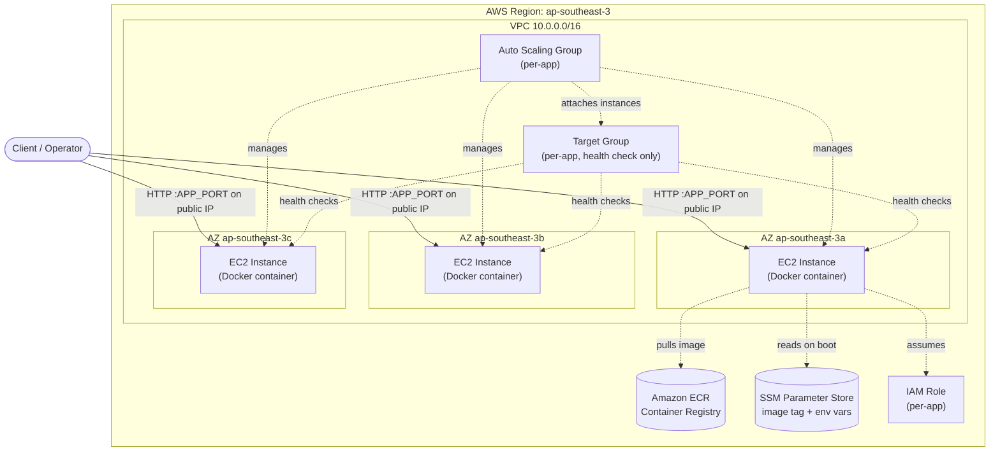
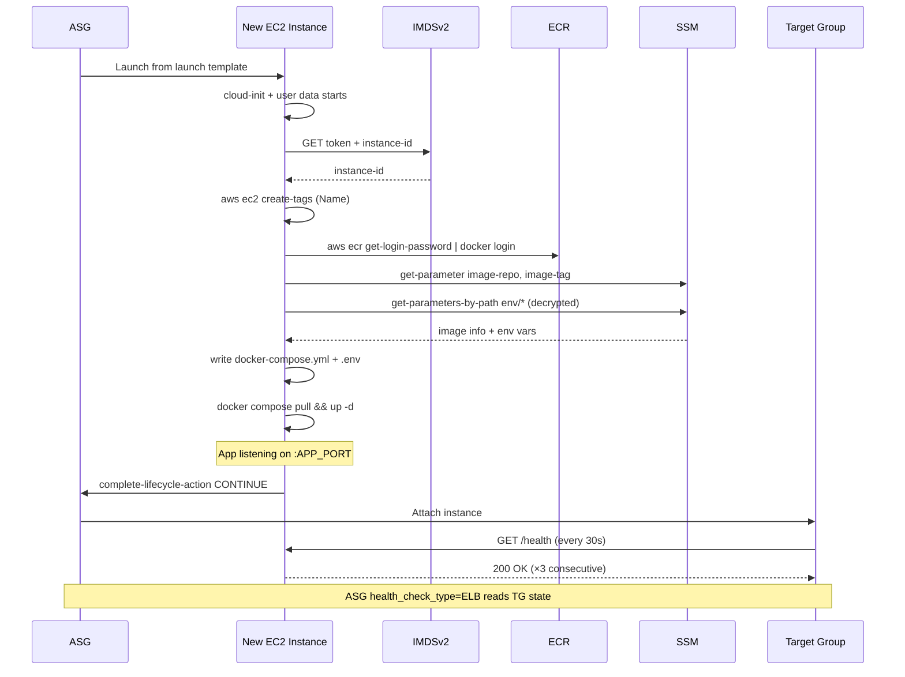
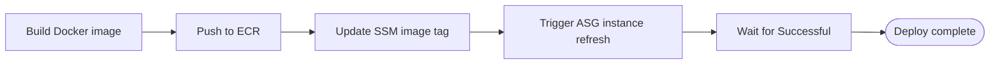

# Architecture Overview

## Summary

EC2 runs Docker containers. No ECS/EKS — ops team don't know container orchestration.

Two things built:

1. **Pre-baked Ubuntu AMI** (Packer) — boots ready for Docker, metrics, self-update.
2. **Terraform + Terragrunt stack** — provisions VPC and a per-app ASG with a target group attached. Runtime config (image tag + env vars) lives in SSM. Two reusable modules: `shared-infra` and `app`. New app = copy one file. No Terraform duplication.

CI/CD deploys without touching Terraform — updates SSM, triggers instance refresh.

> **Load balancing is out of scope right now.** The target group exists because the ASG attaches to it for health-checks (self-healing) — but no ALB is provisioned. Clients reach each instance directly on its public IP. When/if an ALB is needed, it gets wired on top of the existing target group.

---

## High-Level Architecture



Key points:
- ASG spans 3 AZs for fault tolerance.
- Target group runs HTTP health checks on each instance; ASG `health_check_type = "ELB"` reads from it to self-heal unhealthy instances.
- No ALB. Traffic to the app is direct to each instance's public IP on `app_port`.
- Every instance reads config from SSM at boot — no golden config in AMI.

---

## Components

### 1. AMI (Packer)

Pre-baked so startup dominated by `docker pull`, not `apt install`.

| Component | Why |
|---|---|
| Ubuntu 24.04 LTS x86-64 | LTS, team standard |
| Docker engine + Compose plugin | Container runtime |
| AWS CLI v2 | SSM reads, ECR login, self-tagging |
| Prometheus `node_exporter` (systemd) | Host metrics :9100 |
| ZSH + OhMyZSH (history, docker, docker-compose, auto-update) | Better ops shell |
| Unattended-upgrades at midnight UTC+7 (17:00 UTC) | OS patching off-hours |

Build: `packer build packer/ubuntu-docker.pkr.hcl`. AMI ID fed to Terraform via `var.ami_id`.

### 2. Terraform + Terragrunt Stack

Two modules in `terraform/modules/`, orchestrated by Terragrunt units in `terragrunt/`.

#### `shared-infra` module (one per environment)

`terragrunt/production/shared-infra/terragrunt.hcl` consumes this.

| File | Purpose |
|---|---|
| `modules/shared-infra/main.tf` | VPC (3 public subnets, 3 AZs, IGW). |
| `modules/shared-infra/outputs.tf` | Emits `vpc_id`, `vpc_cidr`, `public_subnet_ids` — wiring for `app` module. |

#### `app` module (one per application)

`terragrunt/production/apps/<app_name>/terragrunt.hcl` consumes this. New app = copy one `terragrunt.hcl`, no Terraform duplication.

| File | Purpose |
|---|---|
| `modules/app/target-group.tf` | Target group. Receives ASG attachments; runs health checks against instances but no listener forwards traffic to it. |
| `modules/app/iam.tf` | EC2 IAM role: SSM read, EC2 self-tag, ECR pull, ASG lifecycle, SNS publish |
| `modules/app/ssm.tf` | SSM params under `/<project>/<env>/<app_name>/...` with `lifecycle { ignore_changes = [value] }` |
| `modules/app/security-group.tf` | Per-app SG: app port from `app_port_allowed_cidrs` (default `0.0.0.0/0`), SSH from allowlist, :9100 from VPC |
| `modules/app/asg.tf` | Launch template + ASG, attached to target group, instance refresh enabled |
| `modules/app/sns.tf` | SNS topic for user-data errors |
| `modules/app/templates/user-data.sh.tftpl` | Boot script |

### 3. Boot Script

Glue between instance and running app. Runs once per new instance:

1. **Self-tags** instance as `<asg-name>-<last-4-of-instance-id>` via IMDSv2
2. **Logs into ECR** via instance role IAM credentials
3. **Reads** image repo, image tag, all env vars from SSM (`SecureString`, decrypted in transit)
4. **Writes** `/home/ubuntu/<app_name>/.env` (mode 600) and `docker-compose.yml`
5. **Runs** `docker compose pull && docker compose up -d`



---

## Design Decisions

### 1. SSM = source of truth, not Terraform

Image tag + env vars in SSM. Terraform uses `lifecycle { ignore_changes = [value] }`. CI/CD writes SSM directly.

- **Why:** No Terraform run for deploys. No state-file contention. No Terraform creds in CI. No accidental rollback.
- **Tradeoff:** SSM owns runtime config. Example tfvars must not contain real values.

### 2. Pre-baked AMI

- **Why:** Boot ~30s + image pull vs. ~5min apt install. Matters during scale-out + instance refresh.
- **Tradeoff:** Need pipeline to rebuild AMI for base package updates. Unattended-upgrades handles running instances for now.

### 3. Target group without an ALB

- **Why:** The scope of this project is ASG behavior, not traffic management. An ALB adds listener rules, priorities, path patterns, and default-action design that are noise for the ASG demo. The TG is the minimum surface that lets the ASG's `health_check_type = "ELB"` work, so self-healing still functions.
- **Tradeoff:** No shared ingress, no TLS termination, no path/host routing. Operators hit instances directly on their public IPs. When an ALB is eventually added, it attaches to the existing TG — no ASG/TG re-wiring needed.

### 4. EC2 + Docker, not ECS/EKS

- **Why:** Hard constraint — ops team unfamiliar with container orchestration.
- **Tradeoff:** Re-implement orchestration subset ourselves (instance refresh = rolling deploy, ASG = scheduler). Works, transparent.

### 5. Public subnets only, no NAT gateway

- **Why:** Cost. NAT ~$32/month per AZ. Instances need outbound internet anyway.
- **Tradeoff:** Instances have public IPs. SGs lock :22 to admin allowlist; `app_port` is open to whatever CIDRs are in `app_port_allowed_cidrs` (default `0.0.0.0/0` for demo convenience — tighten if needed).

### 6. `app_name` variable + derived names

- **Why:** Multiple apps in same project/env without collision. Compose dir, SSM prefix, ASG name, IAM role all use `app_name`.
- **Tradeoff:** Each app needs own `terragrunt.hcl`.

---

## Operational Flows

### Deployment (CI/CD, no Terraform)



Full Jenkins example: [updating-with-cicd.md](updating-with-cicd.md).

### Scale-Out

ASG launches instance → user data runs (~30-90s) → TG health passes after 3×30s → `InService`. See [autoscaling-behavior.md](autoscaling-behavior.md).

### Scale-In

ASG selects instance → TG deregistration delay (300s) drains requests → terminate.

### Self-Healing

TG marks instance unhealthy after 3 failures → ASG (reading from TG via `health_check_type = "ELB"`) terminates → ASG launches replacement. No human needed.

---

## Security

| Layer | Control |
|---|---|
| Network | Per-app EC2 SG. App port from `app_port_allowed_cidrs` (default `0.0.0.0/0`; tighten if needed). |
| SSH | Restricted to `var.ssh_allowed_cidrs` (empty by default). |
| Instance metadata | IMDSv2 enforced (`http_tokens = "required"`, hop limit 2). |
| Secrets at rest | Env vars as SSM `SecureString` (KMS-encrypted). |
| Secrets in transit | `aws ssm get-parameters-by-path --with-decryption` over TLS. |
| Secrets on disk | `.env` written mode 600. |
| IAM | Per-app role scoped to that app's SSM path. |
| Audit | Boot output → `/var/log/user-data.log`. |

---

## Project Structure

```
.
├── CLAUDE.md
├── packer/
│   ├── ubuntu-docker.pkr.hcl
│   └── scripts/
├── terraform/
│   └── modules/
│       ├── shared-infra/             # VPC (one per env)
│       └── app/                      # ASG, target group, IAM, SSM, SNS, app SG (one per app)
│           └── templates/
│               └── user-data.sh.tftpl
├── terragrunt/
│   ├── root.hcl                      # Remote state (S3), provider + versions generate
│   └── production/
│       ├── env.hcl
│       ├── shared-infra/
│       │   └── terragrunt.hcl
│       └── apps/
│           └── web/
│               └── terragrunt.hcl
└── docs/
    ├── architecture-overview.md      # ← you are here
    ├── adding-a-new-app.md
    ├── autoscaling-behavior.md
    ├── updating-with-cicd.md
    └── instance-naming.md
```

---

## Adding Second App

No Terraform code changes. Full runbook: [adding-a-new-app.md](adding-a-new-app.md). Short:

1. Pick `app_name` (e.g., `api`).
2. `cp -r terragrunt/production/apps/web terragrunt/production/apps/api`
3. Edit `terragrunt/production/apps/api/terragrunt.hcl`: set `app_name`, image, env vars, port, health check path.
4. Plan then apply (after approval).

---

## Known Gaps

| Item | Priority |
|---|---|
| ALB + HTTPS listener + ACM cert (shared ingress) | High |
| Private subnets + NAT | Medium |
| CloudWatch agent on AMI | Medium |
| Dynamic scaling policies (CPU, request count) | Medium |
| Packer build pipeline (monthly AMI bake) | Low |

---

## TL;DR

Pre-baked AMI + Terraform + Terragrunt stack:
- Autoscaling EC2 with per-app target group driving self-healing (no ALB yet)
- Zero-Terraform deploys via SSM + instance refresh
- Self-healing on instance failure
- One-file path to add new apps (copy one Terragrunt unit)

Ready to deploy once: AMI ID, ECR repo URI, env vars, S3 state bucket provided.
